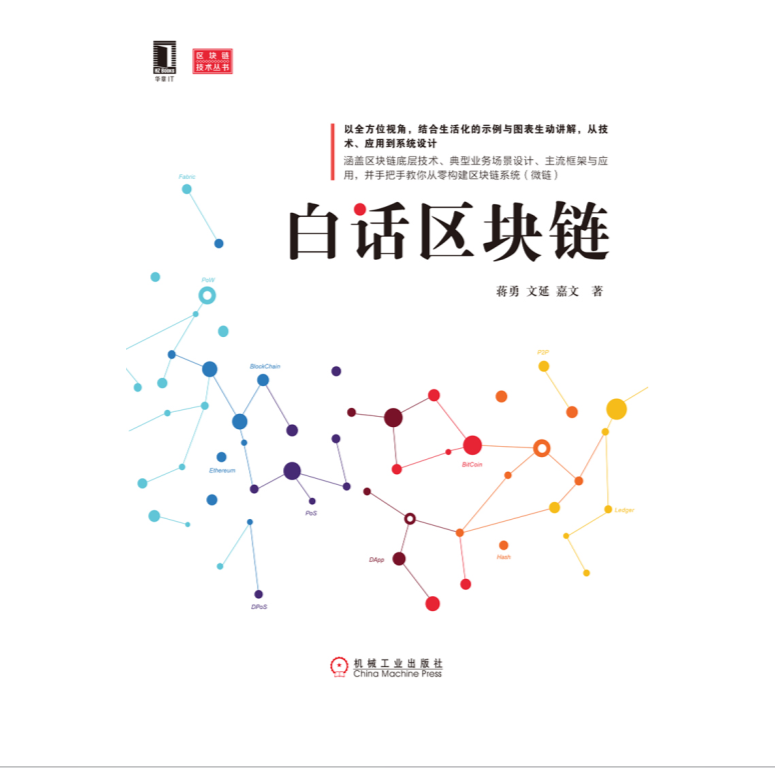
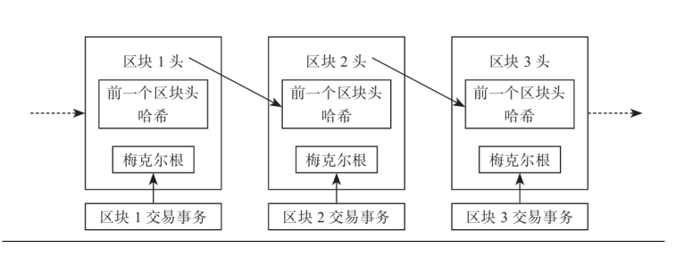
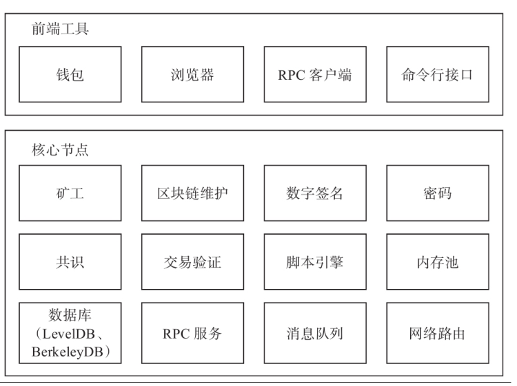
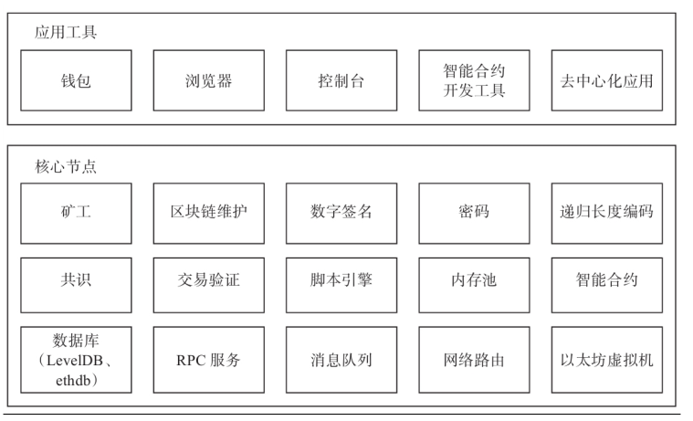
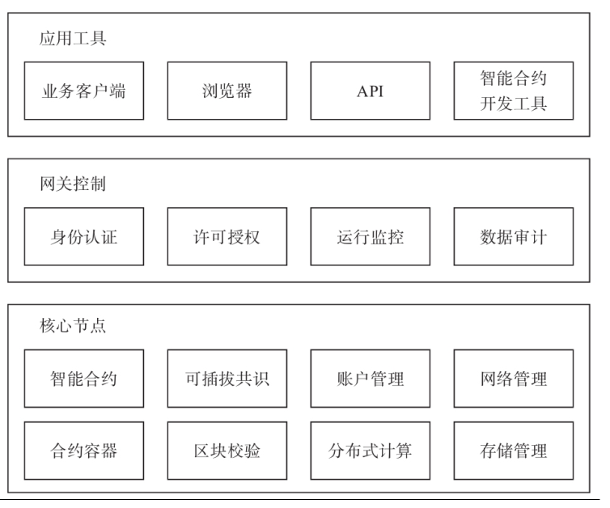

## 区块链技术栈

### 区块链账本

各个区块之间通过链表进行连接：

因为下一个块记录了上一个的哈希值，这就就很难篡改了。区块数据被同步的时候，需要有一个节点专门负责打包，而打包的这个节点就会获得奖励，这就是比特币。

### 共识机制

需要有一套算法，选出一个节点，这个节点负责校验数据。

### 密码算法

就是计算哈希的算法。

### 脚本系统

驱动系统进行各种数据的手法操作，真的是一套代码。

### 网络路由

发现节点、同步数据的网络维护。

## 区块链架构

### 1.0 架构

### 2.0 架构

主要是多了一个智能合约，这似乎是个开发工具。

### 3.0 架构

这个版本时，已经超越比特币，应用在很多行业中。