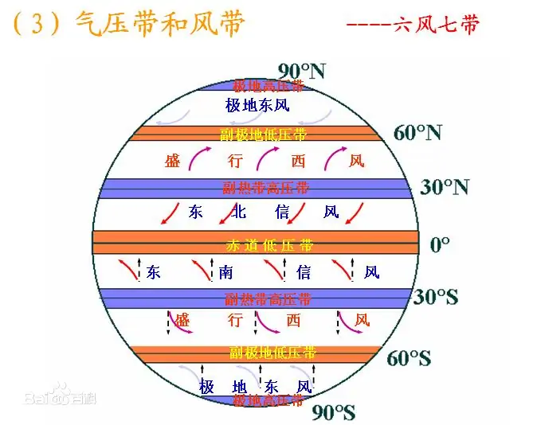

## 23 年极端高温天气

https://www.zhihu.com/question/607397022

### 一些名词解释

#### 地球风带

有所谓六风七带的说法。

从上图能看到，六风是指东南信风、东北信风、两个西风、两个极地东风，七带是指赤道低压带、两个副热带高压带、两个副极地低压带、两个极地高压带。

在赤道地区，由于太阳照射极为充分，温度升高，空气上升，地面出现低压，形成赤道低压带；

赤道低压带上升的空气，随着高度升高而温度降低，空气变重；这些积累的空气会向赤道两侧流动，流动的过程中，会一边前进一边降低高度，最终沉积在南北纬 30 度左右，形成副热带高压带；

而在两个极地，温度低，自然出现高压；

在副热带高压带和极地高压带之间，有副极地低压带，在南北纬 60 度的地方，是一个相对低压的地方。

如果地球静止，则空气流动是南北向标准的；由于地球自转，流动有了偏向。

#### 信风

信风，又称贸易风，因为英文中就是 trade wind，从上图中看到，这是由于赤道低压空气从高空飘向副热带高压带时，在副热带高压带地面。空气由于高压作用，又流回赤道，形成固定的风向。这种风从低温区流向高温区，没什么水汽，比较干燥，很多沙漠都在这个区域。这种风风向固定，稳定出现，所以叫信风。

#### 厄尔尼诺

这是指东太平洋赤道附近，海洋温度异常升高导致全球气候异常的一种现象，西班牙语 EI Nino，圣婴的意思。

这会导致：

- 南美沿岸降水异常，出现洪灾，而部分干旱地区降水减少；
- 东南亚和澳大利亚出现干旱；
- 北美西海岸和南美西北部 降水减少；
- 全球气候异常；

厄尔尼诺一般十年发生一次，持续数月到一年，往往极端结果出现在第二年，因为23年出现了厄尔尼诺，明年会更热。

#### 拉尼娜

和厄尔尼诺相反，西班牙语 La Nina，是指东太气温明显低于西太。

#### 暖脊

这是一种西风带的大型高压系统，会导致暖脊区域痴线晴朗高温天气。

### 帖子内容

从原理方面，前面高赞的几个基本认为是厄尔尼诺是重要原因，同时中国的华北地区出现高压暖脊，导致天气晴朗高温。

有人从消暑方面给了一些回答，比如说人体水分流失量，在体重的百分之二范围内是问题不大的，但是剧烈运动情况下要及时补水，因为2%的阈值这种情况下很容易就越过了。但是补水需要少量多次，不要一次性太多，特别是不能光补充水，不补充电解质，不然会出现低钠症状。

中暑，是由于高温下，水和电解质失去过多，散热功能障碍，中枢神经和心血管系统发生功能障碍，可能导致永久性脑损伤、肾衰竭甚至死亡。中暑根据轻重程度分为先兆中暑、轻症中暑、重症中暑，其中重症中暑又分热痉挛、热衰竭、热射病，这其中热射病最严重，它可能是劳力性热射病，也可能是由于长期待在湿热环境中的非劳力热生病。总之需要及时救治，多喝水不能解决问题，因为电解质流失过多的话，多喝水反而会导致更严重的渗透压失衡，从而出现水中毒。需要补充电解质饮料。